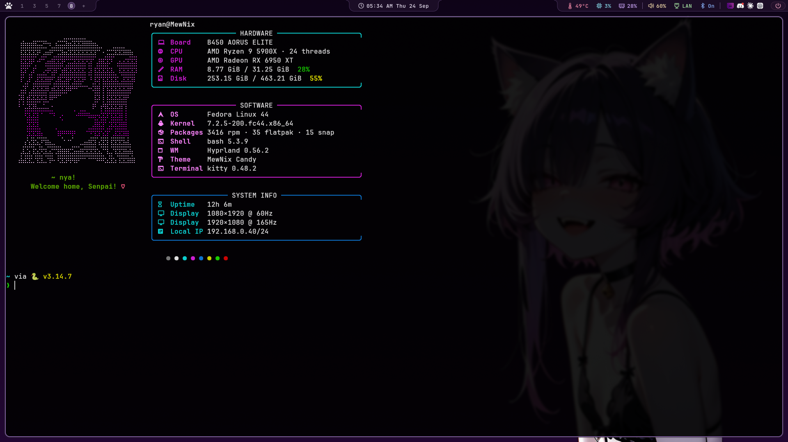
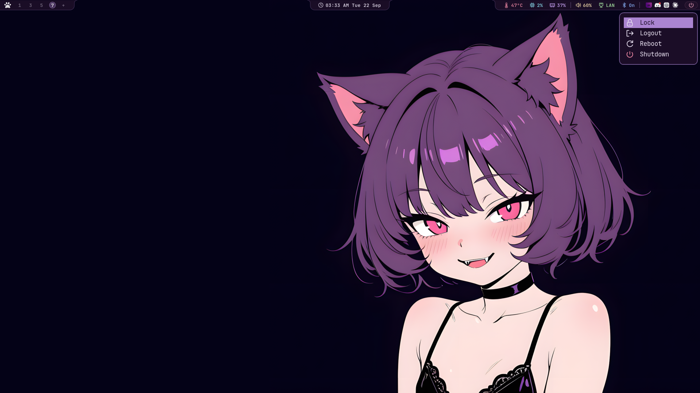
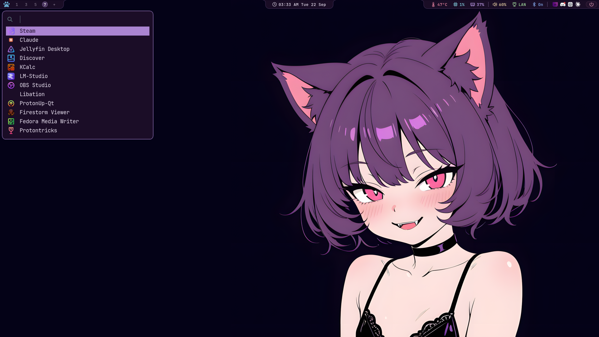
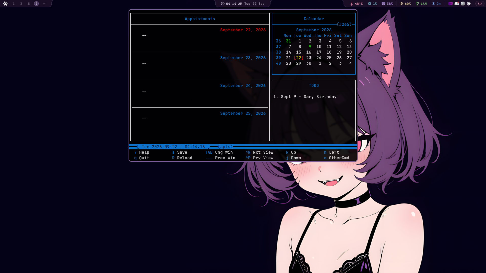

# MewNix Candy Hyprland

A purple-and-rose Hyprland rice with compact Waybar panels, matching SVG status icons, and rounded, flared edges.

## Screenshots

### Desktop and Fastfetch

### Power menu

### Application launcher

### Floating utility windows

Bluetui, Wiremix, and Calcurse run in floating Kitty windows, with their positioning and animations defined in `hyprland.lua`. Calcurse is shown below.

## Included

- 28px Waybar layouts for the main and secondary monitors.
- SVG icons for system stats, audio, network, Bluetooth, clock, and power.
- Matching workspace indicators, subtle underline hovers, and a rose power button.
- Hyprland, Hypridle, Hyprlock, launcher, notification, terminal-shell, and visualizer configuration.
- Wallpapers and the `toggle-float` helper.

## Layout

`[dot]config/` represents `~/.config/`, and `[dot]local/` represents `~/.local/`. The brackets are literal directory names in this repository. Hyprland configuration is under `[dot]config/hypr/`.

These are personal configuration files, rather than an automatic installer. Review the files before copying them into your home directory. Adjust `/home/ryan` paths, monitor names (`DP-1` and `HDMI-A-1`), temperature sensor paths, and application commands for your machine. The included Hyprland configuration uses Lua.

Copy the complete Waybar directory, including `icons/` and `scripts/`; its CSS references the SVG assets. Waybar uses JetBrainsMono Nerd Font. Clicking the utility modules opens terminal applications such as Wiremix, Bluetui, and Calcurse inside Kitty. The included `toggle-float` script lives in `~/.local/bin/` and makes these Kitty utility windows float. Fuzzel provides the application launcher and power menu.
