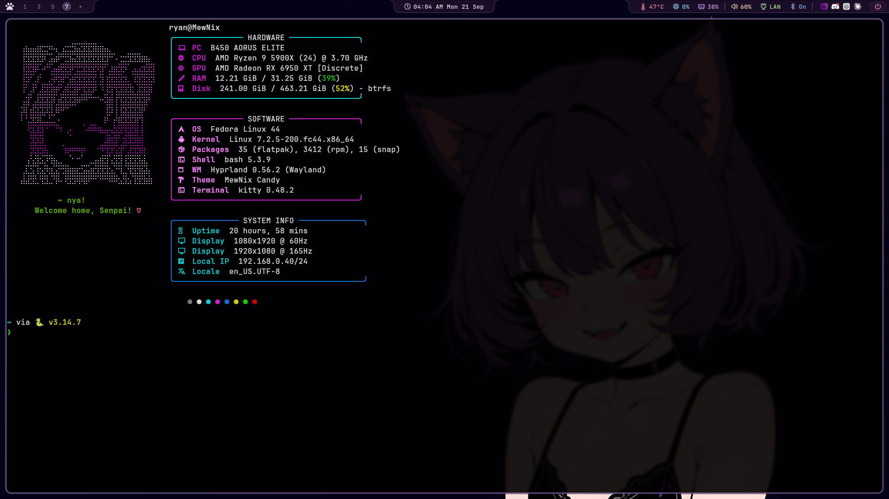

# MewNix Candy Hyprland

A purple-and-rose Hyprland rice with compact Waybar panels, matching SVG status icons, and rounded, flared edges.



## Included

- 28px Waybar layouts for the main and secondary monitors.
- SVG icons for system stats, audio, network, Bluetooth, clock, and power.
- Matching workspace indicators, subtle underline hovers, and a rose power button.
- Hyprland, Hypridle, Hyprlock, launcher, notification, terminal-shell, and visualizer configuration.
- Wallpapers and the `toggle-float` helper.

## Layout

`[dot]config/` represents `~/.config/`, and `[dot]local/` represents `~/.local/`. The brackets are literal directory names in this repository. Hyprland configuration is under `[dot]config/hypr/`.

These are personal configuration files, rather than an automatic installer. Review the files before copying them into your home directory. Adjust `/home/ryan` paths, monitor names (`DP-1` and `HDMI-A-1`), temperature sensor paths, and application commands for your machine. The included Hyprland configuration uses Lua.

Copy the complete Waybar directory, including `icons/` and `scripts/`; its CSS references the SVG assets. Waybar uses JetBrainsMono Nerd Font, and some click actions call Kitty, Fuzzel, Wiremix, Bluetui, Calcurse, and `toggle-float`.

## Updating this repository

The local theme folder is a Git checkout. After saving theme changes into it:

```sh
git status
git diff
git add -A
git commit -m "Update MewNix Candy theme"
git push
```

Run these commands from the theme folder. Review `git status` and `git diff` before staging so only intended theme files are published. Use `git pull --ff-only` before editing to bring in changes made on GitHub.

Git sync is manual: changes in your live `~/.config/` directory are not automatically copied into this repository. Copy the intended updates into `[dot]config/` first.
